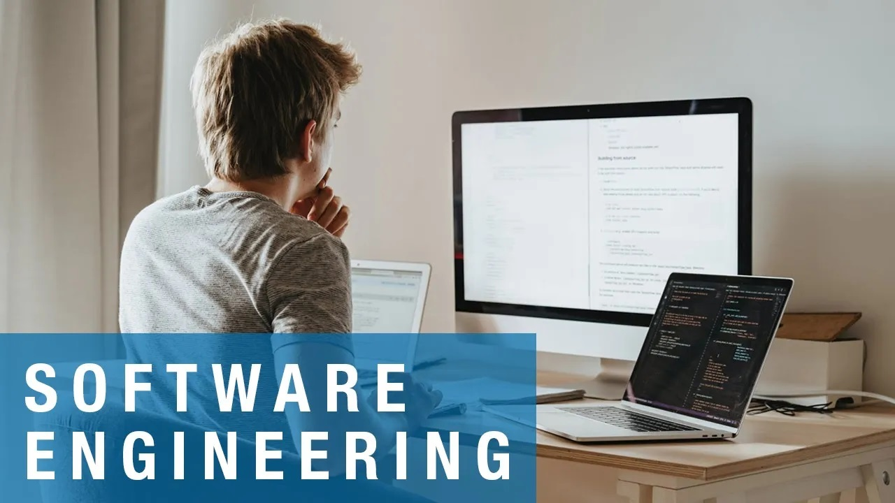

## The End of My Time In ICS 314

At the time of writing this essay, I am nearing the end of my ICS 314 class, software engineering. This software engineering class has taught me so many things, many of them I will be using for the rest of my time as a person in the computer science field. Some things that we have gone over are topics such as ethics in software engineering, coding standards, functional programming, and many more. In this class, I have learned so many essential topics that I can take with me for the rest of my life. Two topics that I would like to talk about in particular are configuration management and agile project management. 

## Configuration Management

One of the topics/modules we went through was a module called, "Configuration Management". I found that this module was one of the most impactful modules to my life because it introduced me to GitHub. Prior to this class, I had heard about GitHub before. However, I did not create an account because it seemed daunting and I was not sure how to use it. But, through ICS 314, I learned about how to become more professional. I got introduced to things like creating a professional portfolio and asking smart questions. But through configuration management, I learned how to get to the next level through GitHub.

Throughout the semester, I learned the ins and outs of GitHub. I found out that I could have a place to manage my code and also make it visible for the public to see on my GitHub profile. Configuration management also introduced me GitHub Desktop, creating branches, merging branches, and many other things to elevate my professional coding skills. 

Configuration management can be used in pretty much every other field in life. It is not just connected to web development and coding, having a way to keep track of files and documenting work is extremely useful in everyday life. Having a place to keep track of work can be used for schooling, writing, making music, and pretty much anything you could think of. One example I can think of off the top of my head is applications like Laulima or Google Classroom. These are used to do things like track assignments, grades, and allows teachers and students to communicate with one another.

## Agile Project Management

Another module we went through in my software engineering class was called, "Agile Project Management". Our final project for this class was to create an application as a group. Prior to taking this class, I have not worked in a group project setting for quite long. This project and module was a great way for me to get a refresher and how to work with others. In the agile project management, we learned how to work together as a team efficiently and also professionally. 

This module felt like a simulation of what we may have to go through in our future jobs. At the very start, we were even required to meet with our groups and create a team contract. This team contract highlighted the expectations we had for each of our members and an agreement for all members to do their job. Other things that we were required to do is document our work in a specific way, team presentations to present the work we have done on our project, and create a project home page for our project. 

This "Agile Project Management" can also be used in any type of project. In ICS 314, we learned how to be professional and how to really function well as a team. We could take these skills that we learned in this module for many other projects for any other class that we have. It ensures that every member knows exactly what they are expected of and sets the bar for the project. Creating this professional environment could lead to projects being superior to other groups who have not taken this approach. 

## Conclusion 

I am very thankful for what I have learned in ICS 314. Not only has this class increased my coding skills, it made me a more professional person through a lot of different ways. Before taking this class, I thought that we would just be making applications and coding. But I learned so much more than that. I learned that software engineering is not just about code and that I can take the lessons I learned in this class into many different aspects of the real world. 

