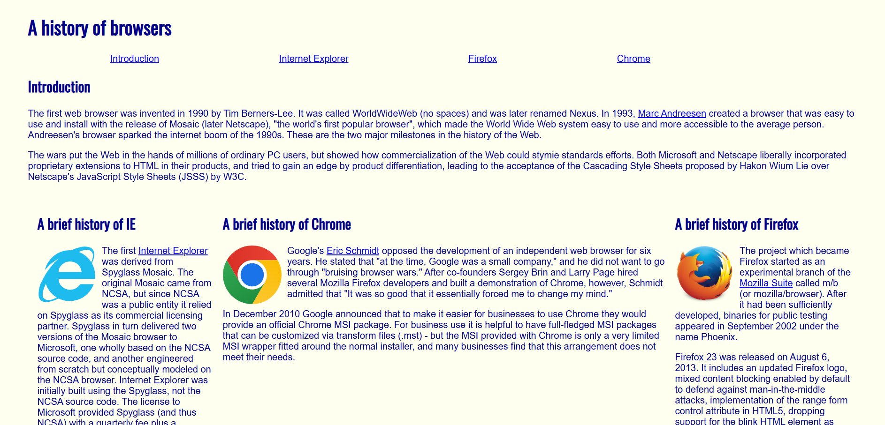
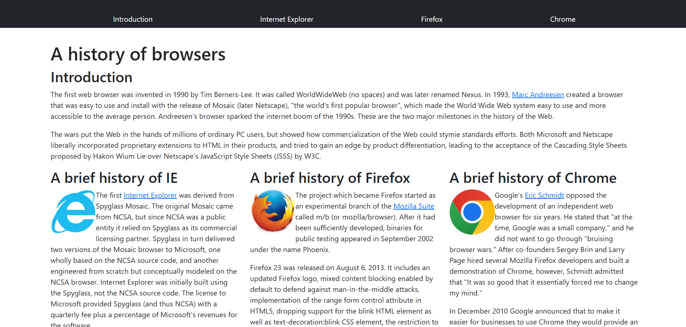

## My Introduction to HTML and CSS

Over the past two weeks at the time of writing this, I have been learning HTML and CSS in my software engineering class. To start off, we were required to complete the introduction course to HTML and CSS on freeCodeCamp. My initial thoughts when I saw the language was, "Wow this is really complicated". There are a lot of tags to learn with the language and at the start, it felt a bit scary.

For example, as shown below:

```cpp
<head>
</head>
<body>
<h1></h1>
<div></div>
<h2></h2>
</body>
```

Above are some examples of different tags that are a part of HTML. At first sight, having to remember what all of these tags do seemed very intimidating. When I got to the CSS portion of the introduction, it only added more things to remember and know how they function. Just to name a few: color which changes the color of the text, background-color which changes the background color, and font-size which sets the size of the text. Although this was all a lot of information to grasp, I thought that this was really interesting. Making websites and designing them is something that I have never done before and I was excited to learn more!

## Introduction to UI Frameworks

After about a week of practice with HTML and CSS, I was introduced to UI frameworks. More specifically, I was working with Bootstrap 5. In my opinion, Bootstrap 5 was a lot harder to understand and get my mind around. There is just so much potential that Bootstrap offers and so much more content that I had to learn. But, I saw the reasons behind why to use Bootstrap. It makes websites more user friendly, offers a lot more components for people to use, and also in a lot of ways simplifies what you need to code compared to raw HTML and CSS. However, learning it and becoming comfortable using UI frameworks is a very difficult task. 

 



The top picture is a picture of a website that I made about the history behind various browsers. The website is called "A history of browsers". Aside from the information that is included about the browsers, there are also links of various topics where readers can learn more. 

The picture below is my recreation of the exact same website but instead, I used Bootstrap 5 tools to make it. As you can see, there is one major difference between the two websites. In the Bootstrap version, I have a black bar at the top where I can navigate to different sections of the website. Whereas in the original, I just had 4 links at the top. The navigation bar at the top is just one of many other things that you can use Bootstrap for. 

## Conclusion

With my experience with UI frameworks, I think that they are very complicated. It takes a lot of time to know how each and every little thing works. Especially with my small amount of experience with HTML and CSS, I had and still have lots of trouble trying to wrap my head around most concepts. However, I do see the benefits of becoming comfortable with UI frameworks. Although they are complex, they actually make coding in HTML and CSS simpler. 

