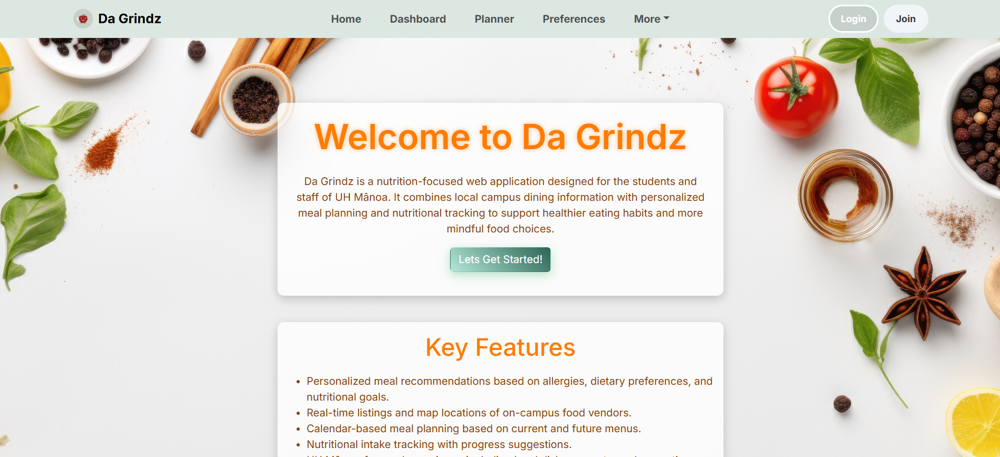
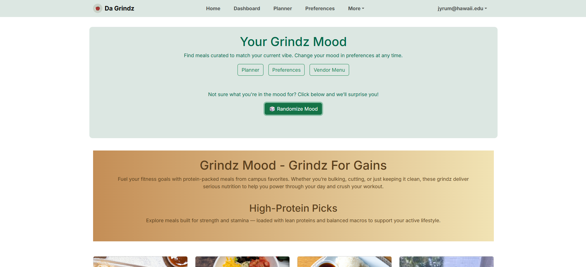
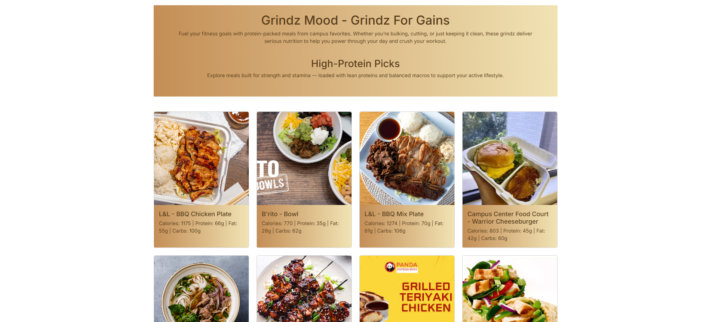
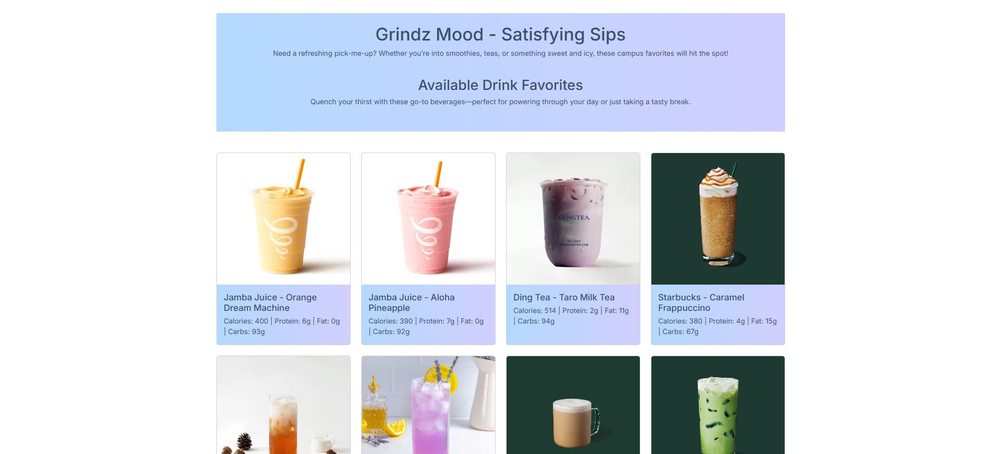
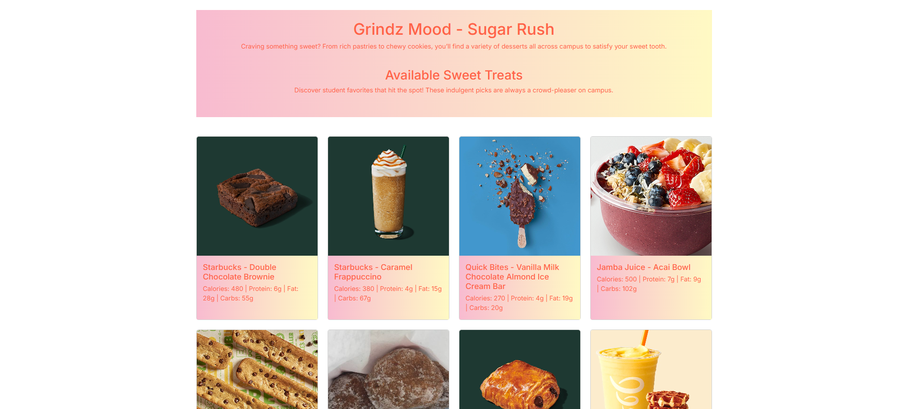
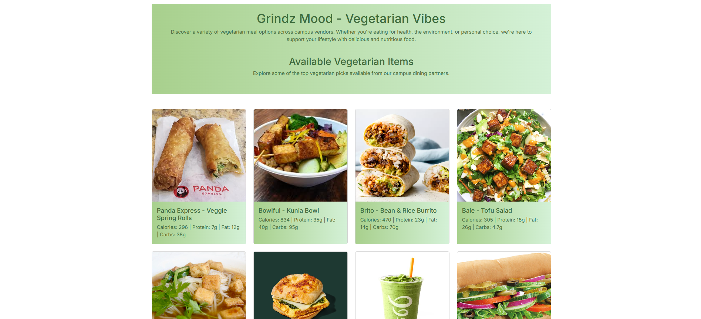
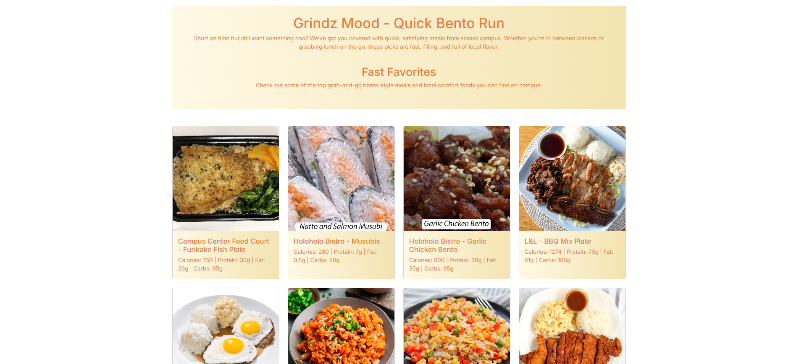

Da Grindz is a nutrition-focused web application designed for the students and staff of UH Mānoa. It combines local campus dining information with personalized meal planning and nutritional tracking to support healthier eating habits and more mindful food choices. Some of the key features of this application are personalized meal recommendations based on allergies, dietary preferences, and nutritional goals, real-time listings and map locations of on-campus food vendors, and calendar-based meal planning. 

The "special sauce" of Da Grindz is after registration, users set their current “grindz mood”. This will affect meal suggestions from vendors and UI themes and motivational quotes tied to that mood. Both of which can be viewed on the dashboard page. The grindz moods that we have so far are "Grindz for Gains", "Satisfying Sips", "Sugar Rush", "Vegetarian Vibes", and "Quick Bento Run".

Da Grindz was created by a team of six computer science students, including myself. My contributions to this project were creating the dashboard page. The dashboard page is where the grindz mood is primarily used. Depending on what grindz mood that a user has picked on a preferences form, the dashboard page changes in design and showcases as recommendations different types of foods. I also helped others with various questions about code and the design of our website. 

I personally learned a lot through this project. Some coding topics I learned a lot about were writing to a database, reading from a database, and also creating a custom API for a button that randomizes the mood of a user in the database if they do not know what type of mood they are feeling at that moment. Clicking the button changes their mood in the database and shortly after, updates the dashboard page to showcase the page tied to the new grindz mood. 

Throughout this project I also learned the difficulties of group work. One major difficulty I noticed was communication. Communication is key when working on a project and over time our group slowly improved at that. However, we still had major hiccups and bumps in the road leading to the deadline for the project. 

Below are pictures of the dashboard pages tied to the grindz moods. 

### Learn More!
- [Da Grindz Homepage](https://da-grindz.github.io/)
- [Da Grindz GitHub](https://github.com/da-grindz)
- [Da Grindz App](https://da-grindz.vercel.app/)

