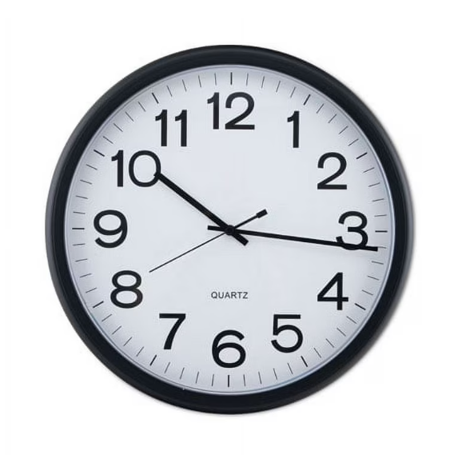

This function takes two parameters, seconds and a boolean leapYear. The seconds parameter takes in any amount of seconds (as long as it is less than the amount of seconds in a year and leapYear respectively). The leapYear parameter is true if it is a leap year and false if it is not. This is important because if it is a leap year, it changes the date and time since there are more seconds in the year. In order to compute the date and time, there are a bunch of arithmetic operations being used. 

For this assignment, I worked on it independently. This was the first assignment I was given for my ICS 211 class. From this assignment, it was definitely an assignment that made me use my brain and gave me a good review on the coding language Java. I had to really think about working around leap years and the way that affects my computations. 

Below is an excerpt of my Dates class

```cpp
public class Dates {
	public static String computeDateTime(long seconds, boolean leapYear) {
		
		//String array contained with all the months in a year
		String [] months = {"Jan", "Feb", "Mar", "Apr", "May", "Jun", "Jul", "Aug", "Sep", "Oct", "Nov", "Dece"};
		
		//integer array with the days of each month
		int [] days = {31, 28, 31, 30, 31, 30, 31, 31, 30, 31, 30, 31};
		if (leapYear) {
			days = new int[]{31,29, 31, 30, 31, 30, 31, 31, 30, 31, 30, 31};
		}
		
		//loop that deals with cases where the amount of seconds do not work 
		if (seconds < 0 || (leapYear && seconds >= 31622400) || (!leapYear && seconds >= 31536000)){
		return ("illegal number of seconds");
		}
		//using a while loop to figure out which month of the year it is
		int numberOfMonth = 0;
		while (seconds >= (days[numberOfMonth] * 86400)){
			seconds -= days[numberOfMonth] * 86400;
			numberOfMonth++;
		}
		
		//computing which day of the month it is, adding one because there is no day "0"
		int day = (int)(seconds / 86400) + 1;
		seconds %= 86400;
		
		//computing which hour of the day it is
		int hour = (int)(seconds / 3600);
		seconds %= 3600;
		
		//computing which minute of the hour it is
		int min = (int)(seconds / 60);
		int sec = (int)seconds % 60;
		
		//return statement that formats as the assignment states
		return (months[numberOfMonth] + " " + day + " " + String.format("%02d:%02d:%02d", hour, min, sec));
	}
}
```

