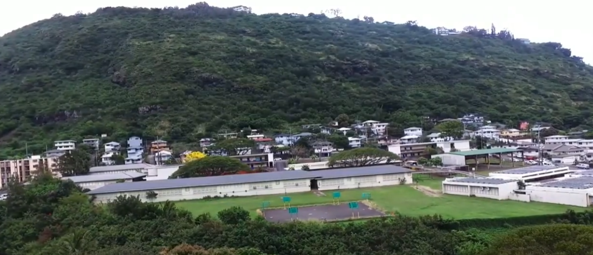

This research proposal analyzed the relationship between children that live in disadvantaged neighborhoods and lack of success in education. In the state of Hawaii, the cost of living is significantly higher than other places in the world, making it one of the most expensive places to live. The research done in this project helps determine the connection between disadvantaged children in Hawaii and how well they do in school. I worked on this research proposal by myself. Conducting all of the research, creating my proposal, recording the voiceover/video, and editing the video into the final product.

The research done in this proposal can be used as evidence to prove that children that are born into financially struggling families struggle in their education. They do not do as well as their peers around them because of things such as mental problems and their lack of resources. By assisting children, they will then help others as well. If we give back to disadvantaged children by giving them the means to a good education, then their lives will change greatly and they will live better lives in the future. 

This project includes a research proposal and an edited YouTube video about my findings. From this project, I learned a lot about my community. I also gained meaningful time management skills because since I did this for my SOC 100 class I took over the summer, I had to finish it within a short amount of time. Most of all, I learned how edit a video and the struggles with editing. 

[Research Proposal: Unlucky Education](https://docs.google.com/document/d/14eFabzt6rV1p2cmt-p5teAMYenNocO_1HJjLPQB6SbI/edit?usp=sharing)

[YouTube: Unlucky Education](https://youtu.be/PqQ9tj-l4FI)

